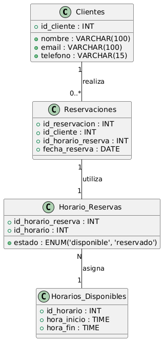

# Modelo de Datos para el Sistema de Reservaciones

Este repositorio contiene el modelo de datos diseñado para gestionar un sistema de reservaciones. Se incluyen las entidades principales del sistema y las relaciones entre ellas, basadas en los requerimientos del sistema.

---

## **Descripción del Modelo de Datos**

El modelo de datos está compuesto por las siguientes entidades principales:

1. **Clientes**:
   - Representan a las personas que realizan reservaciones.
   - Contienen información básica como nombre, correo electrónico y teléfono.

2. **Reservaciones**:
   - Almacenan los datos relacionados con cada reservación realizada por un cliente.
   - Incluyen la fecha de la reservación, así como la relación con un horario reservado.

3. **Horarios Disponibles**:
   - Representan los horarios que pueden ser reservados.
   - Incluyen información sobre la hora de inicio y fin de cada bloque horario.

4. **Horario de Reservas**:
   - Conectan los horarios disponibles con las reservaciones.
   - Contienen un estado (`disponible` o `reservado`) para indicar si el horario está libre o ya está asignado.

---

## **Relaciones Entre Entidades**

### **Diagrama UML del Modelo**

A continuación, se presenta un diagrama UML que muestra las entidades y sus relaciones:

### **Descripción de las Relaciones**

1. **Clientes y Reservaciones**:
   - Relación: **Uno a Muchos**.
   - Un cliente puede realizar múltiples reservaciones, pero cada reservación pertenece a un solo cliente.
   - Justificación: Permite gestionar fácilmente todas las reservaciones de un cliente.

2. **Reservaciones y Horario de Reservas**:
   - Relación: **Uno a Uno**.
   - Cada reservación está asociada a un único horario reservado, y cada horario reservado pertenece a una sola reservación.
   - Justificación: Asegura que no haya conflictos al asociar reservaciones con horarios específicos.

3. **Horario de Reservas y Horarios Disponibles**:
   - Relación: **Muchos a Uno**.
   - Varios horarios de reserva pueden estar asociados a un mismo horario disponible, dependiendo de cómo se configuren los bloques de tiempo.
   - Justificación: Proporciona flexibilidad para reutilizar horarios disponibles en diferentes contextos.

---

## **Justificación del Diseño**

El diseño del modelo está basado en los siguientes principios:

1. **Claridad y Organización**:
   - Las entidades están diseñadas para representar conceptos del mundo real de manera clara y directa.

2. **Integridad Referencial**:
   - Las relaciones están definidas con claves foráneas para garantizar la consistencia de los datos.

3. **Escalabilidad**:
   - El modelo permite la adición de nuevas entidades o atributos sin necesidad de una reestructuración significativa.

4. **Evitar Conflictos de Reservaciones**:
   - La relación entre `Reservaciones` y `Horario de Reservas` asegura que no se puedan asignar múltiples reservaciones al mismo horario.

---

## **Criterios de Evaluación**

1. **Claridad y Detalle del Modelo**:
   - El modelo está diseñado para ser intuitivo y fácil de entender, con relaciones claramente definidas.

2. **Coherencia en las Relaciones y Justificaciones**:
   - Las relaciones entre las entidades son consistentes con los requerimientos funcionales del sistema.

---
