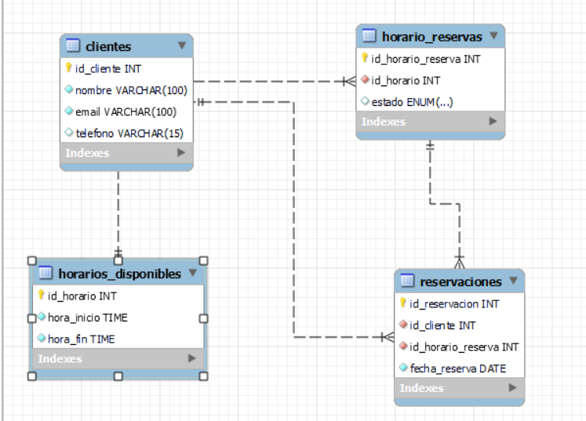

# Sistema de Reservaciones - Modelo, Base de Datos y Aplicaciones

Este repositorio contiene el modelo de datos, el esquema de base de datos en MySQL y las consultas SQL diseñadas para gestionar un sistema de reservaciones. También incluye enlaces a los repositorios del backend y frontend del sistema.

---

## **Sección 1: Interpretación y Modelado de Requerimientos**

### **Descripción**

El sistema de reservaciones está diseñado para gestionar los siguientes elementos:
- **Clientes**
- **Horarios Disponibles**
- **Horarios de Reserva**
- **Reservaciones**

### **Modelo de Datos**

El siguiente diagrama UML muestra las entidades y sus relaciones:

### **Relaciones Principales**

1. **Clientes y Reservaciones**:
   - Relación: **Uno a Muchos**.
   - Cada cliente puede realizar varias reservaciones.

2. **Reservaciones y Horarios de Reserva**:
   - Relación: **Uno a Uno**.
   - Cada reservación está asociada a un único horario reservado.

3. **Horario de Reservas y Horarios Disponibles**:
   - Relación: **Muchos a Uno**.
   - Varios horarios reservados pueden estar asociados a un horario disponible.

**Criterios Evaluados:**
- **Claridad y detalle del modelo**: Las relaciones entre entidades están bien definidas y justificadas.
- **Coherencia en las relaciones**: Cada relación está diseñada para reflejar correctamente los requerimientos del sistema.

---

## **Sección 3: Base de Datos MySQL**

### **Esquema de Base de Datos**

El esquema de la base de datos implementado en MySQL está diseñado de acuerdo al modelo de datos definido. 

### **Consultas SQL**

El archivo [consulta-sql.sql](consulta-sql.sql)
